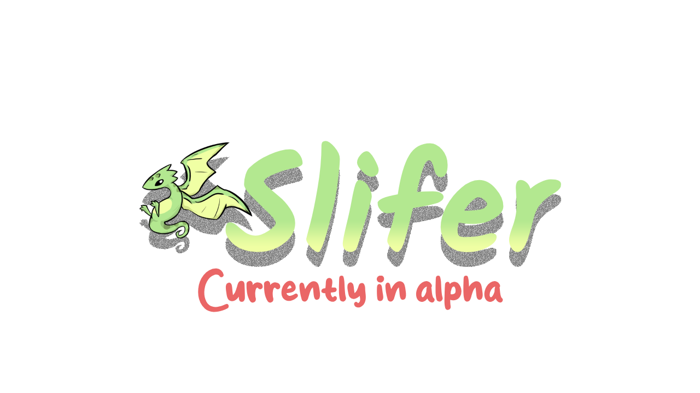

# Slifer : Native Typescript Game Framework

<p align="center">
    
</p>

> [!CAUTION]
> Slifer is currently in alpha. Use at your own risk.
>
> [!INFO]
> Not all basic features have been implemented. Many are missing such as window customization.
> As such, I recommend waiting for a beta release of Slifer before using it for a long term project.

Slifer is a game framework made to allow users to code games in typescript. The framework uses bun and SDL2 under the hood to allow your game to render and build natively to desktop.

## Contents
- [Goals](#goals)
- [Current Features](#current-features)
- [Future Features](#future-features)
- [Example](#example)

## Goals

- Contain all basic game framework implementations. Such as drawing images, drawing text and making animations from a sprite sheet.
- Provide an easy transition from web development to game development.
- Create an easy to use framework. Slifer should handle the bulk of the work
- Keep updates consistent.

## Current Features
- Create a native desktop window with custom title and size.
- Handle both keyboard and mouse inputs
- Load and draw images onto the window

## Future Features
- Audio Implementation
- Animation library
- Save file library

## Example
```ts
import Slifer from Slifer;

Slifer.createWindow("Example Window", 1280, 720);

const bg = Slifer.Graphics.makeColor(36, 36, 36, 255);

while (!Slifer.shouldClose()) {
    Slifer.Graphics.setBackground(bg);

    if (Slifer.Keyboard.isPressed('escape')) {
        Slifer.isRunning = false;
    }

    Slifer.Graphics.render();
}

Slifer.quit();
```